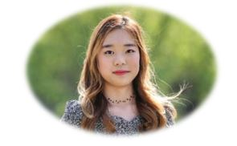

## Intro

 

Hi there! I’m currently working as a Data Analyst at Boeing Research & Technology (BR&T) in the AI team. 
Just like Boeing's motto **“The Future is Built Here”✈️**, my team and I are doing novel research to push the boundaries of AI.  I am involved in AI projects related to **automated visual inspection** and **human action recognition for autonomous vehicles**. I am cherishing every moment of learning, researching, and having fun with my fantastic colleagues.

I joined Boeing in January of 2018 as part of the **International Business Internship Program (IBIP)**, where I relocated to Seattle, WA for 6 months to work in **BR&T Global R&D Strategy (GRADS)** Team. I returned to South Korea after the internship to finish my last year of university, and during my senior year, I worked as a part-time intern to help a director establish Boeing's 7th International Research Center in Seoul, South Korea. That research center has been named _**"Boeing Korea Engineering & Technology Center (BKETC)"**_ and I subsequently joined full time there after my graduation! It has been quite a journey.  

## Research Interest

My research interests lie in **Resilient Intelligence for Ambient Safety**, which my 2+ aerospace industry experience has fostered. Specifically, I want to research methodologies to understand why the model has made a particular decision by extracting human comprehensible information from the black box model. Designing novel ML approaches to nudge the model to focus on more relevant & appropriate features will be a step toward much sounder and cogent safety decisions. Ultimately, I hope to build a _**smart safety ecosystem that self-perpetuates and improves through adaptive AI**_.

## Education

I graduated from **Yonsei University**, with a **B.A. in Business Administration** and a **B.S. in Computer Science**. I also have a Samsung Convergence Software Course (SCSC) certificate, and aspire to apply my skillsets on interdisciplinary problems involving technology and business. Outside of courses, I was involved in an IT Business Strategy project focusing on service and UX aspects of SK Telecom’s AI assistant Nugu, which is a Korean version of Alexa / Google Home. I received scholarship from KFAS (Korea Foundation for Advanced Studies) during my 4 years of undergraduate studies. 

## Hobbies

 

Sports-wise, I love swimming and roller blading. I have played the clarinet for 10+ years and I’m very fond of the dulcet and mellow sound of this beautiful woodwind instrument. I also love traveling and appreciating diversity in the cities I go to. Here's one of my favorite photo from Perth, Australia when I went to SIGGRAPH ASIA 2019 as a student volunteer. Can you see the countless shades of blue? 🌊🌊

### Thanks for visiting my website, and feel free to reach out to me for any inquiries! ❤️
