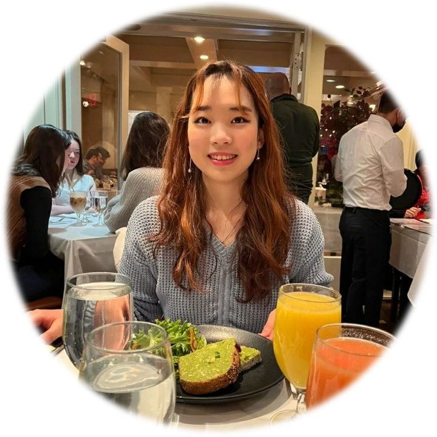
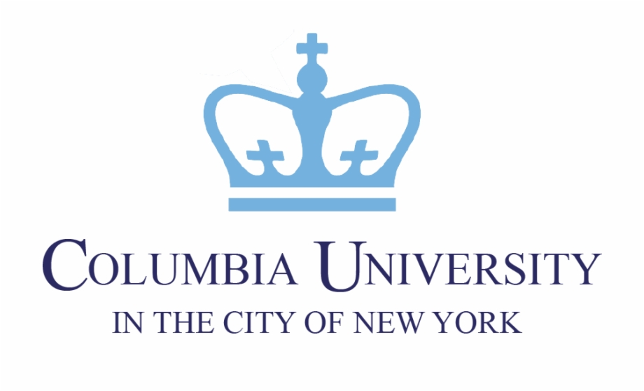

   

Hi - currently I am a 1st year CS master’s student at Columbia University, specializing in Machine Learning. I am passionate about creating a **✨positive disruption✨ in making AI trustworthy, safer, and fairer for various users in various contexts**. You can reach me at cp3227@columbia.edu.

My interest in **Explainable and Robust ML** was fostered through my extensive research experience at Boeing, where I was involved in ***Automated Visual Inspection*** and ***Autonomous Flight*** projects that emphasizes both performance and explainability of AI models. This research resulted in a US patent pending, ICCV 2021 accepted 1st author paper. I have also closely collaborated with Boeing Directors and cross functional teams in different time zones to establish a new Boeing R&D center (BKETC) in South Korea from scratch. In addition, I have demonstrated leadership and project management skills where I have shaped and managed many of Boeing's research portfolio projects and milestones.

I have leveraged my academic background to better understand and navigate not only the research problem itself, but also the entailing business impacts, opportunities, and risks which helped me approach a problem with a holistic perspective. I believe such skills and unique experiences differentiate me from other engineers and researchers.

I was an undergraduate Korea Foundation for Advanced Studies (KFAS) Scholarship scholar, and currently a Korean Government Study Abroad Scholarship scholar.

 

## Publications

<ins>**LFI-CAM: Learning Feature Importance for Better Visual Explanation**</ins>

**ICCV 2021** ***(International Conference on Computer Vision)***

Kwang Hee Lee, **Chaewon Park**, Junghyun Oh, Nojun Kwak

<a href="https://bit.ly/3FIRi2r">`Paper`</a> <a href="https://github.com/TrustworthyAI-kr/LFI-CAM">`Code`</a> <a href="https://lnkd.in/g-fNx7KU">`Video`</a>

 
 

<ins>**Boeing Intelligent Data Management System (BIDMS) for ML/DL-based Automated Inspections**</ins>

**BTEC 2020** ***(Boeing Technical Excellence Conference)***

**Chaewon Park**, Jay Oh, Kwanghee Lee, Minwoo Kwon, Youngsuk Cho

 

## Work Experience

     &nbsp;&nbsp;&nbsp;&nbsp;&nbsp;&nbsp; <ins>**Amazon Web Services**</ins>

&nbsp;&nbsp;&nbsp;&nbsp;&nbsp;&nbsp; **SDE Intern - Redmond, WA, USA (May 2022 ~ Aug 2022)**

 
 

  &nbsp; &nbsp; &nbsp; &nbsp;<ins>**Boeing Research & Technology**</ins>

 &nbsp; &nbsp; &nbsp; &nbsp;**Advanced Technologist (Data Analyst) - Seoul, South Korea (Aug 2019 ~ June 2021)**

 &nbsp; &nbsp; &nbsp; &nbsp;**Tech Integrator - Seoul, South Korea (Sept 2018 ~ July 2019)**

 &nbsp; &nbsp; &nbsp; &nbsp;**Business Strategy Intern - Seattle, WA, USA (Jan 2018 ~ July 2018)**

 

## Education

        &nbsp;&nbsp;<ins>**Columbia University**</ins>

&nbsp;&nbsp;***M.S. in Computer Science (Dec 2022)***

 
 

      &nbsp;&nbsp;<ins>**Yonsei University**</ins> 

&nbsp;&nbsp;***B.S. in Computer Science, B.A. in Business Administration (Aug 2019)***

 
 

## Academic Research/Teaching Experience

<ins>**Deep Learning Course Teaching Assistant**</ins>

***<a href="https://www.cs.columbia.edu/~idrori/deeplearningcuspring2022.html">COMS 4995 Deep Learning course</a>:***

***Spring '22 course with 108 students taught by Professor <a href="https://www.cs.columbia.edu/~idrori/">Iddo Drori</a>***

 

<ins>**Deep Learning Research Assistant (Sep 2021 ~ Dec 2021)**</ins>

***<a href="https://academiccommons.columbia.edu/doi/10.7916/d8-6vr9-3f26">UltrasonOS Project</a>:***

***Developed a low-cost, open-source portable ultrasound system for medical imaging using Deep Learning models***

Advisor: Post-doc <a href="https://ueil.bme.columbia.edu/people/yazmin-feliz">Yazmin Feliz</a>, Professor <a href="https://www.hodlipson.com/">Hod Lipson</a> 

Columbia University’s Creative Machines Lab, Ultrasound Elasticity and Imaging Laboratory at the New York Presbyterian Hospital (Irving Medical Center)

 

## Research Interest

My research interest lies in **enabling trustworthy and safe autonomous vehicles through Explainable AI**. Specifically, I want to research methodologies to understand why the model has made a particular decision by extracting human comprehensible information from the black box model. I am fascinated how Explainable AI can identify inherent biases and out-of-distributions, while shedding light on ‘why’ the system is behaving as it does through visualizations, words, and metrics. Ultimately, I envision Detect-and-Avoid systems for Disruptive Mobility to leverage robust Explainable AI on multimodal data. I believe rethinking the entire architecture principle to prioritize safety and embedding trustworthy mechanisms for preventing failures is essential, which is why my research interest has tremendous social value.

`Keywords: Computer Vision · Explainable AI · Visual Explanation · Resilient AI · Robust ML · AI for Safety · AI for Good · Trustworthy AI`

Just like Boeing's motto _“The Future is Built Here”✈️_, I do novel research to push boundaries of AI.   
  
  

## Hobbies

 

Sports-wise, I love swimming and roller blading. I have played the clarinet for 15+ years and I’m very fond of the dulcet and mellow sound of this beautiful woodwind instrument. I also love traveling and appreciating diversity in the cities I go to. Here's one of my favorite photo from Perth, Australia when I went to SIGGRAPH ASIA 2019 as a student volunteer. Can you see the countless shades of blue? 🌊🌊

### Thanks for visiting my website, and feel free to reach out to me for any inquiries! ❤️
