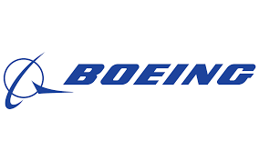
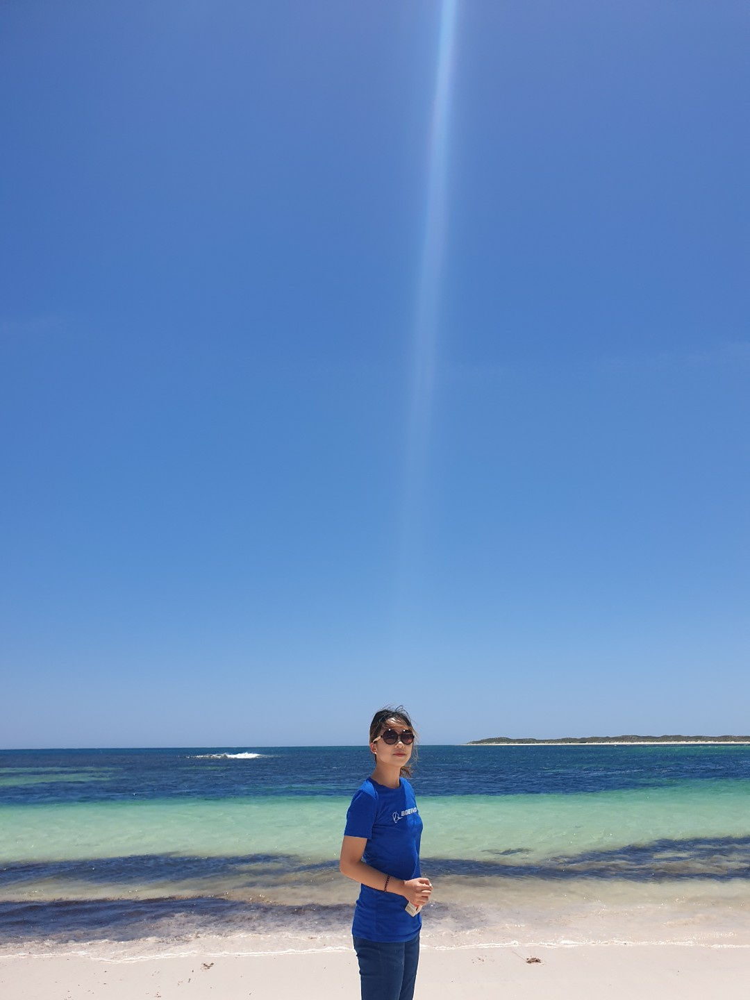

 

## Intro

**Currently an Advanced Technologist (Data Analyst) at Boeing Research & Technology (BR&T) AI Team**.  

 

Just like Boeing's motto _“The Future is Built Here”✈️_, my team and I do novel research to push the boundaries of AI. I am involved in projects related to <ins>**automated visual inspection** and **human action recognition for autonomous vehicles**</ins>, cherishing every moment of learning, researching, and having fun with my fantastic colleagues.

I joined Boeing in January of 2018 as part of the **International Business Internship Program (IBIP)**, where I relocated to **Seattle, WA** for 6 months to work in **BR&T Global R&D Strategy (GRADS)** Team. I returned to South Korea after the internship to finish my last year of university, and during my senior year, I worked as a part-time intern to help a director establish Boeing's 7th International Research Center in Seoul, South Korea. That research center has been named _**"Boeing Korea Engineering & Technology Center (BKETC)"**_ and I subsequently joined full time there after my graduation! It has been quite a journey.  

## Research Interest

My research interest lies in **enabling trustworthy and safe autonomous vehicles through Explainable AI**. Specifically, I want to research methodologies to understand why the model has made a particular decision by extracting human comprehensible information from the black box model. I am fascinated how Explainable AI can identify inherent biases and out-of-distributions, while shedding light on ‘why’ the system is behaving as it does through visualizations, words, and metrics. Ultimately, I envision Detect-and-Avoid systems for disruptive mobility to leverage robust Explainable AI on multimodal data. Designing novel ML approaches to nudge  models to focus on more relevant & appropriate features will be a step toward much sounder and cogent safety decisions in all domains.

* You can check out the ["Ideas"](https://emilypark0418.github.io/pages/ideas.html) section of this website where I organize my thoughts and brainstorm. 

## Education

**Yonsei University** - Seoul, Republic of Korea (2015 ~ 2019)  
Bachelor of Science in Computer Science and Engineering  
Bachelor of Arts in Business Administration  
Samsung Convergence Software Course (SCSC) certificate   
**KFAS (Korea Foundation for Advanced Studies) scholarship** (2016 ~ 2019)

**University of Connecticut** - Storrs, CT, USA (2016)  
Exchange Student  

* You can check out the ["CV"](https://emilypark0418.github.io/pages/cv.html) & ["Previous Projects"](https://emilypark0418.github.io/pages/projects.html) section of this website for more details.

## Hobbies

 

Sports-wise, I love swimming and roller blading. I have played the clarinet for 10+ years and I’m very fond of the dulcet and mellow sound of this beautiful woodwind instrument. I also love traveling and appreciating diversity in the cities I go to. Here's one of my favorite photo from Perth, Australia when I went to SIGGRAPH ASIA 2019 as a student volunteer. Can you see the countless shades of blue? 🌊🌊

### Thanks for visiting my website, and feel free to reach out to me for any inquiries! ❤️
