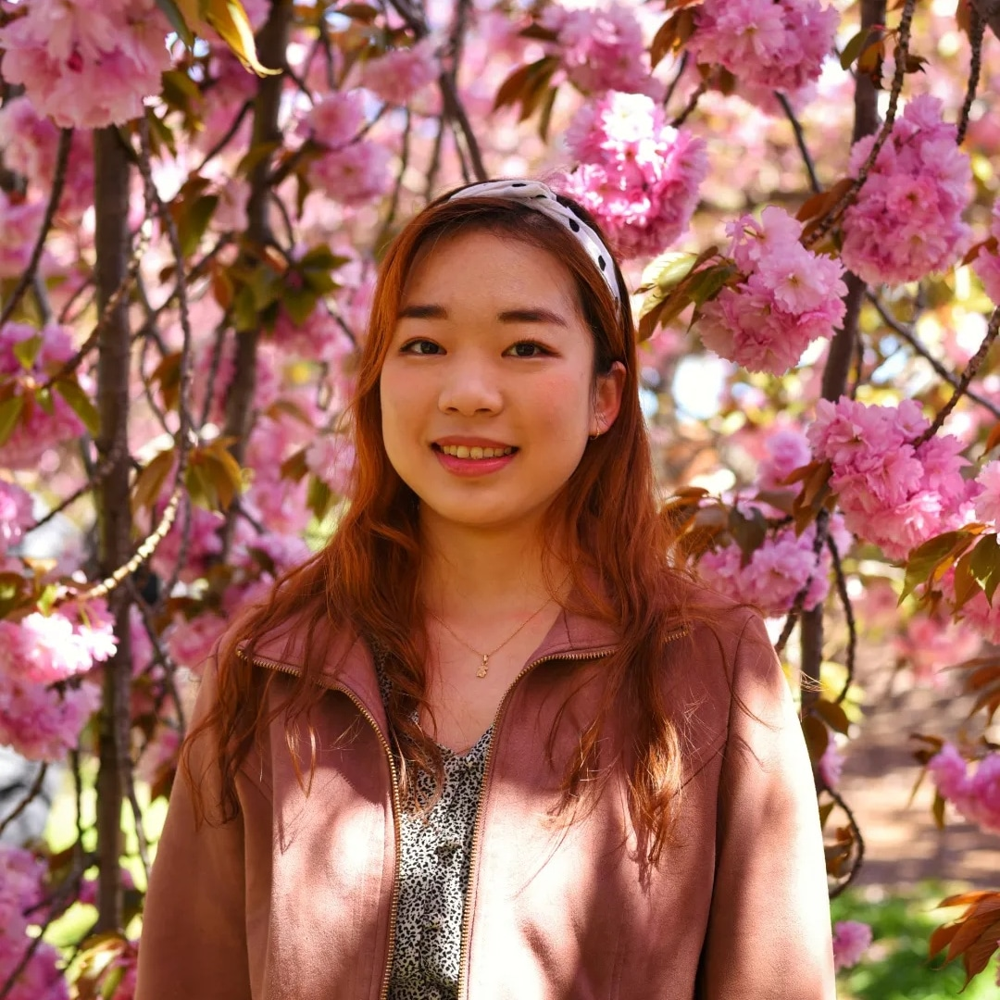
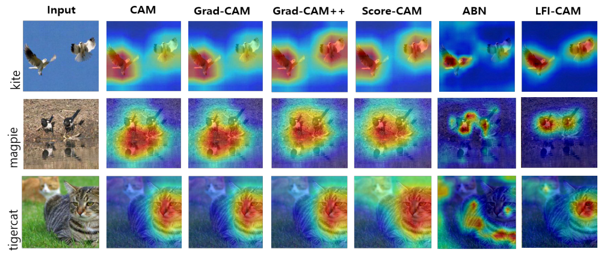
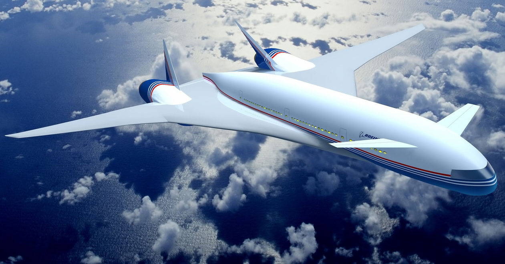
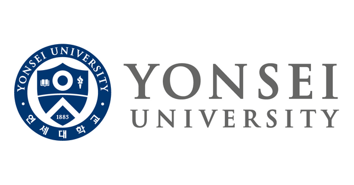

   

Hi - my name is Emily and I'm a Machine Learning Engineer at Boeing in Seattle, WA. My aspiration is to create **✨positive disruptions✨** in our society, including but not limited to fields like education, medicine, finance, urban mobility, smart factory, etc. by **making ML and software technologies more trustworthy, safer, and fairer** to be **on par with human intelligence, and even beyond**. I graduated from Columbia University with a Master's in Computer Science and Yonsei University with a Bachelor's in Computer Science and Business Administration. I've also interned at AWS ElasticMapReduce Serverless team as an SDE intern in the summer of 2022.

My interest in **Explainable, Trustworthy, and Robust ML** was fostered through my extensive research experience at Boeing. Currently I am working on a ***Contour Scanning*** project for 2D & 3D monocular cargo detection models to enable pallet ID tracking and volume reconstruction for Qatar Airlines’ cargo loading logistic optimization. Previously, I was involved in ***Automated Visual Inspection*** and ***Autonomous Flight*** projects that emphasizes both performance and explainability of AI models. This research resulted in a US patent pending, ICCV 2021 accepted 1st author paper, <a href="https://bit.ly/3FIRi2r">LFI-CAM</a>. I have also closely collaborated with Boeing Directors and cross functional teams in different time zones to establish a <a href="https://www.linkedin.com/pulse/our-one-global-team-driving-future-naveed-hussain/">new Boeing R&D center (Boeing Korea Engineering & Technology Center, BKETC)</a> in South Korea from scratch as a founding member. In addition, I have demonstrated leadership and project management skills where I have shaped and managed many of Boeing's research portfolio projects and milestones.

I have leveraged my academic background to better understand and navigate not only the research problem itself, but also the entailing business impacts, opportunities, and risks which helped me approach a problem with a holistic perspective. I believe such skills and unique experiences differentiate me from other engineers and researchers.

In undergrad, I was a <a href="https://eng.kfas.or.kr/theme/kfaschanel/intl_scholarship_5.php">Korea Foundation for Advanced Studies (KFAS) Scholarship</a> scholar, and during my Master's program, I had the honor of being a <a href="https://www.studyinkorea.go.kr/en/sub/gks/allnew_government.do">Korean Government Overseas Study Scholarship</a> scholar. If you have any inquiries, you can reach me at <cp3227@columbia.edu>.

 

## Publications

* <a href="https://scholar.google.com/citations?user=HzHwgPUAAAAJ&hl=en"> Google Scholar Citations </a>

   

 

<ins>**LFI-CAM: Learning Feature Importance for Better Visual Explanation**</ins>

**ICCV 2021** ***(International Conference on Computer Vision)***

Kwang Hee Lee, **Chaewon Park**, Junghyun Oh, Nojun Kwak

<a href="https://bit.ly/3FIRi2r">`Paper`</a> <a href="https://github.com/TrustworthyAI-kr/LFI-CAM">`Code`</a> <a href="https://lnkd.in/g-fNx7KU">`Video`</a>

 
 

   

 

<ins>**Boeing Intelligent Data Management System (BIDMS) for ML/DL-based Automated Inspections**</ins>

**BTEC 2020** ***(Boeing Technical Excellence Conference)***

**Chaewon Park**, Jay Oh, Kwanghee Lee, Minwoo Kwon, Youngsuk Cho

 
 
 

## Work Experience

    &nbsp;&nbsp;&nbsp;&nbsp;&nbsp;&nbsp; <ins>**Amazon Web Services**</ins>

&nbsp;&nbsp;&nbsp;&nbsp;&nbsp;&nbsp; **SDE Intern - Redmond, WA, USA (May 2022 ~ Aug 2022)**

 
 
 

  &nbsp; &nbsp; &nbsp; &nbsp;<ins>**Boeing Research & Technology**</ins>

 &nbsp; &nbsp; &nbsp; &nbsp;**AI Software Engineer - Seattle, WA (April 2023 ~ current)**

 &nbsp; &nbsp; &nbsp; &nbsp;**Data Analyst - Seoul, South Korea (Aug 2019 ~ June 2021)**

 &nbsp; &nbsp; &nbsp; &nbsp;**Tech Integrator - Seoul, South Korea (Sept 2018 ~ July 2019)**

 &nbsp; &nbsp; &nbsp; &nbsp;**Business Strategy Intern - Seattle, WA, USA (Jan 2018 ~ July 2018)**

 

## Education

        &nbsp;&nbsp;&nbsp;&nbsp;&nbsp;<ins>**Columbia University**</ins>

&nbsp;&nbsp;&nbsp;&nbsp;&nbsp;***M.S. in Computer Science (Feb 2023)***

 
 

        &nbsp;&nbsp;&nbsp;&nbsp;&nbsp;<ins>**Cornell University**</ins>

&nbsp;&nbsp;&nbsp;&nbsp;&nbsp;***ML Certificate (2021)***

 
 

      &nbsp;&nbsp;&nbsp;&nbsp;&nbsp;<ins>**Yonsei University**</ins> 

&nbsp;&nbsp;&nbsp;&nbsp;&nbsp;***B.S. in Computer Science, B.A. in Business Administration (Aug 2019)***

 
 

## Academic Research/Teaching Experience

<ins>**Deep Learning Course Teaching Assistant**</ins>

***<a href="https://www.cs.columbia.edu/~idrori/deeplearningcuspring2022.html">COMS 4995 Deep Learning course</a>:***

***Spring '22 course with 108 students taught by Professor <a href="https://www.cs.columbia.edu/~idrori/">Iddo Drori</a> (Jan 2022 ~ May 2022)***

 

<ins>**Deep Learning Research Assistant**</ins>

***<a href="https://academiccommons.columbia.edu/doi/10.7916/d8-6vr9-3f26">UltrasonOS Project</a>:***

***Developed a low-cost, open-source portable ultrasound system for medical imaging using Deep Learning models (Sep 2021 ~ Dec 2021)***

**Advisor: Post-doc <a href="https://ueil.bme.columbia.edu/people/yazmin-feliz">Yazmin Feliz</a>, Professor <a href="https://www.hodlipson.com/">Hod Lipson</a>**

**Columbia University’s Creative Machines Lab, Ultrasound Elasticity and Imaging Laboratory at the New York Presbyterian Hospital (Irving Medical Center)**

 

## Research Interest

My research interest lies in **enabling trustworthy and safe ML through Explainable AI**. Specifically, I want to research methodologies to understand why the model has made a particular decision by extracting human comprehensible information from the black box model. I am fascinated how Explainable AI can identify inherent biases and out-of-distributions, while shedding light on ‘why’ the system is behaving as it does through visualizations, words, and metrics. Ultimately, I envision Detect-and-Avoid systems for Disruptive Mobility to leverage robust Explainable AI on multimodal data. I believe rethinking the entire architecture principle to prioritize safety and embedding trustworthy mechanisms for preventing failures is essential, which is why my research interest has tremendous social value.

Just like Boeing's motto _“The Future is Built Here”✈️_, I do novel research to push boundaries of AI.   

`Keywords: Computer Vision · Explainable AI · Visual Explanation · Resilient AI · Robust ML · AI for Safety · AI for Good · Trustworthy AI`

 

## Hobbies

Sports-wise, I love swimming, ice skating, and roller blading. I enjoy watching figure skating Olympians perform on ***Stars on Ice***!

I have played the ***clarinet*** for 15+ years and I’m very fond of the dulcet and mellow sound of this beautiful woodwind instrument. I was actively involved in orchestras and musical performances since elementary school, and even at Boeing I was part of an orchestra. In college, I was part of a band and played keyboard.

I also love ***traveling*** and appreciating diversity in the cities I go to. Here's one of my favorite photo from Perth, Australia when I went to SIGGRAPH ASIA 2019 as a student volunteer. Can you see the countless shades of blue? 🌊🌊

**Thanks for visiting my website, and feel free to reach out to me for any inquiries! ❤️**
